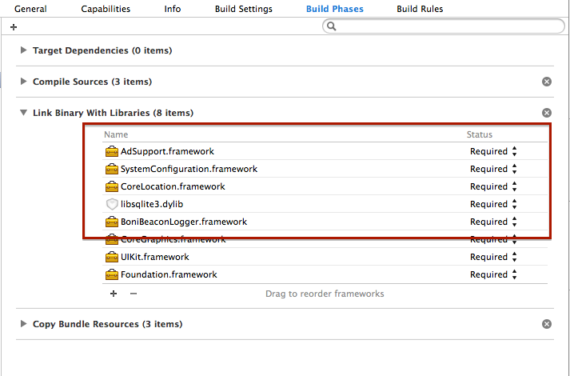
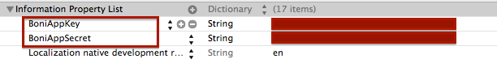
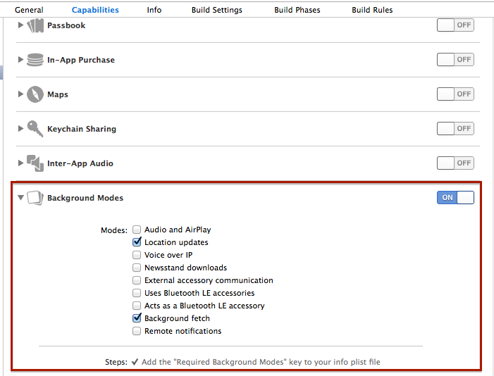

BoniBeaconLoggerSDK-iOS
=======================

Boni Beacon Logger SDK for iOS devices.

Overview
-------

BoniBeaconLogger is main class of the framework. It contains start and stop logging methods.

Installation
-------

1. Add BoniBeaconLogger.framework file to Link Library in Build Phases. Additonally, add following frameworks to your project:
    * libsqlite3.dylib
    * CoreLocation.framework
    * SystemConfiguration.framework
    * AdSupport.framework
   

2.  Put your BoniAppKey and BoniAppSecret values to .plist file.
   

3.  Open your Project Settings and go to Capabilities tab, switch on Background Modes and add these:
    * Location updates
    * Background fetch
   

Important!
-------
This framework uses Improper Advertising Identifier [IDFA] data. You would respect the Limit Ad Tracking setting in iOS during App Store submission.

For more info [click here.](https://developer.apple.com/library/ios/documentation/AdSupport/Reference/ASIdentifierManager_Ref/ASIdentifierManager.html)
